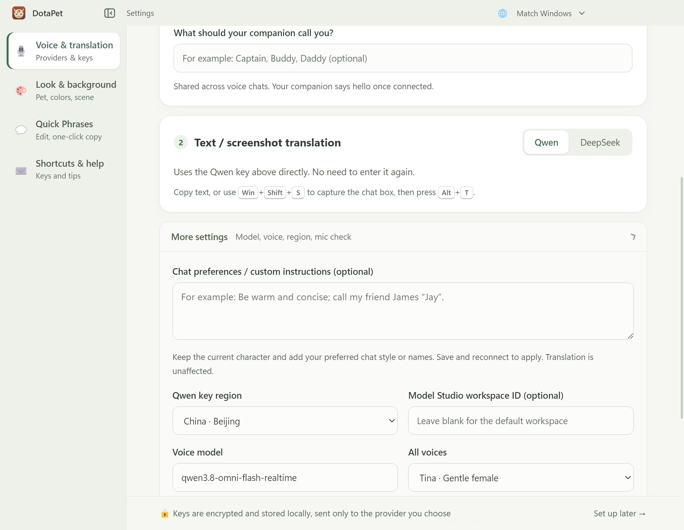
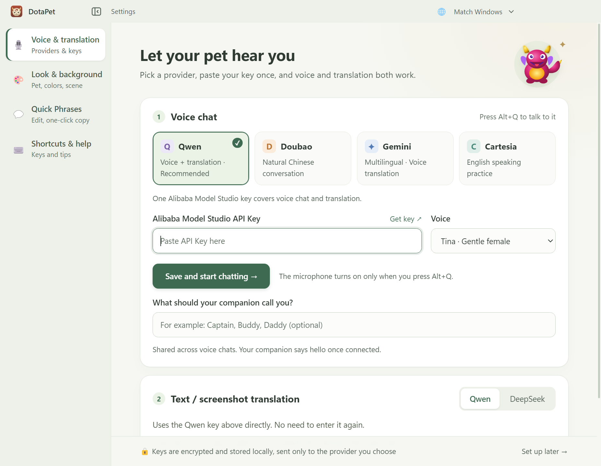
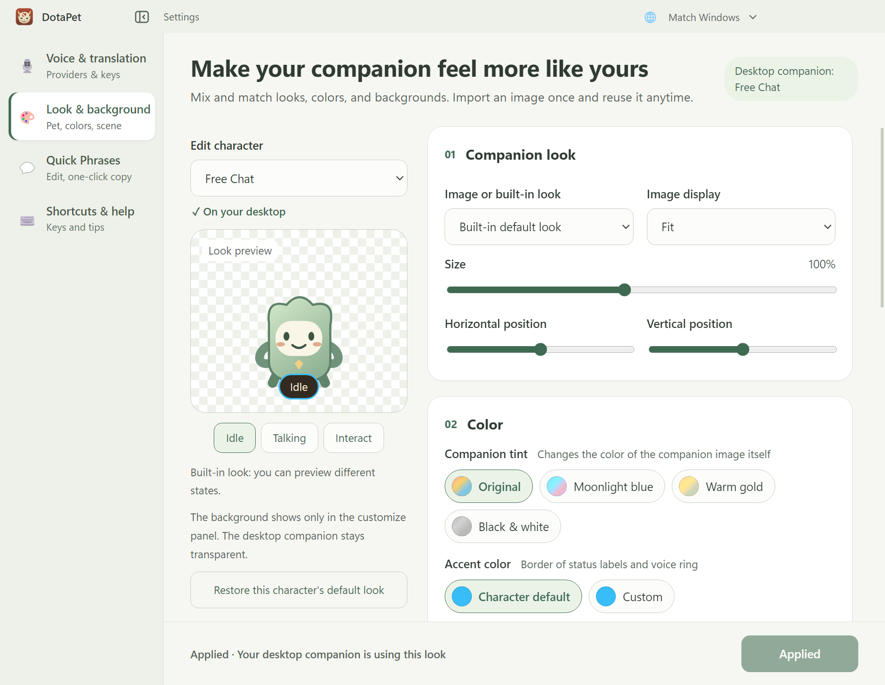
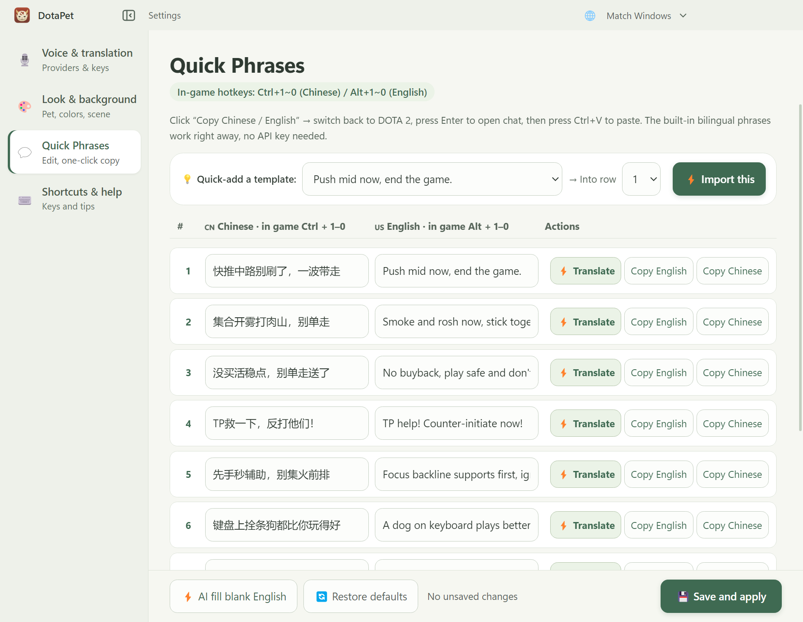
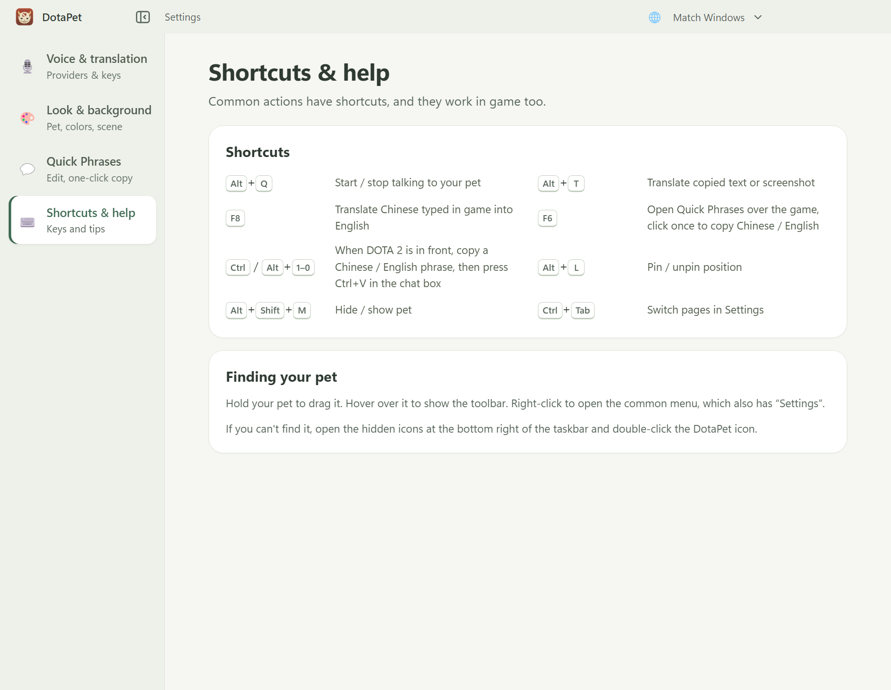
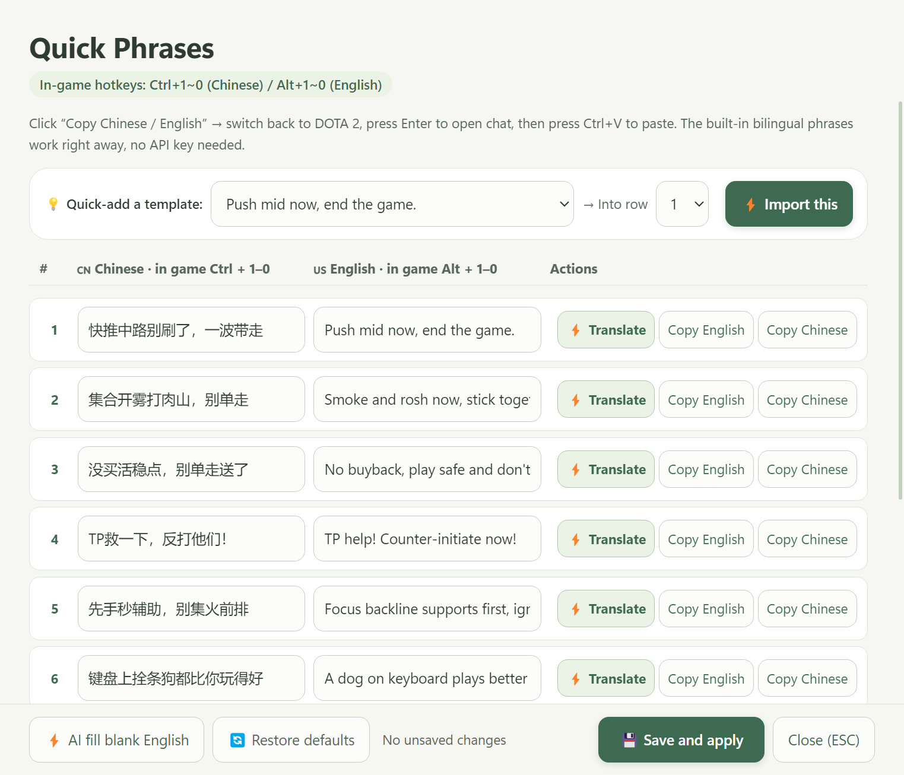

<div align="center">


# DotaPet

### A little company on your desktop. A little teamwork in your game.

DOTA 2 desktop companions · AI voice chat · Bilingual phrases · Text & screenshot translation

[](https://github.com/xiaobaoliu849/dotapet/actions/workflows/ci.yml)
[](LICENSE)

[Download](https://github.com/xiaobaoliu849/dotapet/releases) · [User guide](docs/README_COMPANION_RELEASE.md) · [Changelog](CHANGELOG.md) · [Report an issue](https://github.com/xiaobaoliu849/dotapet/issues)

[简体中文](README.md) · **English**

</div>

<br>

Keep a hero or courier on your desktop, chat with it, and make it your own. In DOTA 2, reach for bilingual quick phrases or translate a screenshot of team chat into Chinese. Desktop companionship works without configuring an AI provider.

**Current source and build: 0.2.0. Published GitHub installer: 0.1.2.** The screenshots below show the current source UI. The project is an early Windows preview; the latest features require 0.2.0.

**Latest voice settings: your preferred name, custom chat instructions, and an opening greeting once connected.** The screenshot below shows the new name and instruction fields directly.



<p align="center"><sub>One settings center for providers, appearances, phrases and help. Choose 中文 / English / Русский / Українська from the title bar.</sub></p>

<details>
<summary><strong>View the full voice and translation settings</strong></summary>



</details>

## Meet your companion

| | What you can do |
|---|---|
| **Desktop company** | Pick a hero or courier, let it roam, drag it around and interact. Hover to reveal its toolbar; right-click for everyday actions. |
| **Voice chat** | Choose Qwen, Doubao, Gemini or Cartesia, with common voices and a local microphone check. Features using the same account share a saved key. |
| **Chat translation** | Use Qwen or DeepSeek for text and screenshots. `Alt+T` translates clipboard content; `F8` translates your own Chinese game-chat input into English. |
| **Quick phrases** | Edit Chinese / English phrases in settings or open the floating `F6` panel. Existing bilingual phrases need no API key. |
| **Your own look** | Customize images, colors and backgrounds, favorite pictures and reuse presets. Preview before applying to your desktop companion. |
| **Game events** | DOTA 2 GSI integration for hero detection, combat events and game-timing reminders. |

## Explore the current UI

<table>
  <tr>
    <td width="50%"><strong>Appearance & backgrounds</strong><br><sub>A fixed character preview beside scrollable settings.</sub></td>
    <td width="50%"><strong>Bilingual quick phrases</strong><br><sub>Edit in place, copy either language, and use the same list in F6.</sub></td>
  </tr>
  <tr>
    <td></td>
    <td></td>
  </tr>
  <tr>
    <td><strong>Shortcuts & help</strong><br><sub>Everyday controls, together in one place.</sub></td>
    <td><strong>The floating F6 panel</strong><br><sub>Your bilingual phrases within reach while playing.</sub></td>
  </tr>
  <tr>
    <td></td>
    <td></td>
  </tr>
</table>

<details>
<summary><strong>See the desktop companion and About page</strong></summary>

<p align="center">
  
  
</p>


The About screenshot uses Chinese UI and simulated **0.3.0** update data. It does not indicate a published release. All screenshots come from the actual Electron app using isolated fixtures.

</details>

## Get started

1. **Install.** Download the published `DotaPet-Setup-0.1.2.exe` from [GitHub Releases](https://github.com/xiaobaoliu849/dotapet/releases). End users do not need Node.js. Run 0.2.0 from source to try the latest UI shown here.
2. **Choose how to use it.** Current source opens settings on first launch. Choose a voice provider, enter your own key and start chatting, or skip setup to enjoy the desktop companion first.
3. **Return to your desktop.** Hover over the companion for its toolbar. Right-click to open settings. Double-click the tray icon to find a hidden companion.

In voice settings, enter **What should your companion call you?** (for example, Captain, Buddy or Daddy). Under **More settings**, add chat preferences for tone, reply style or what to call friends. These preferences apply across voice providers after saving and reconnecting. Each new chat connection you start gets an opening greeting; microphone toggles and connection tests do not repeat it. Live translation is unaffected.

### Keep these shortcuts handy

| Action | Shortcut |
|---|---|
| Start / stop talking | `Alt+Q` |
| Translate a chat screenshot | `Win+Shift+S` to capture it, then `Alt+T` |
| Translate copied text | Copy it, then `Alt+T` |
| Translate your Chinese game-chat input into English | `F8`; review the result before sending |
| Open the floating phrase panel | `F6` |
| Copy Chinese / English phrase 1–10 | With DOTA 2 focused: `Ctrl+1–9/0` / `Alt+1–9/0`, then paste with `Ctrl+V` |
| Hide / show the companion | `Alt+Shift+M` |
| Switch settings pages | `Ctrl+Tab` |

Translation does not require the microphone. Existing bilingual phrases work without credentials; voice chat and cloud translation use your own provider account and API keys.

## Languages, data and updates

Settings and the F6 panel support Chinese, English, Russian and Ukrainian. The companion toolbar, menus and tray are still Chinese. Russian and Ukrainian translations need native-speaker review. See the [language guide](docs/README_I18N.md).

Keys are saved using Windows encryption. Voice or screenshot content is sent to the provider you select when you use those features, with the provider's usage charges. Capture just the chat area, and keep keys and personal configuration out of the repository.

Starting with 0.2.0, **Settings → About & updates** supports verified downloads and installation with relaunch. Startup and four-hour checks do not download automatically; closing settings lets you install later. Keys, voices and custom appearances are preserved. Older installations need one manual installation of 0.2.0 once that release is published.

The installer is currently unsigned. Real cloud recognition quality, latency and fullscreen behavior still need in-game validation. Continuous automatic OCR and recognition of teammates' voice chat are not implemented.

[Installation guide (Chinese)](docs/README_COMPANION_RELEASE.md) · [Customization](docs/README_CUSTOMIZATION.md) · [Languages](docs/README_I18N.md) · [Translation roadmap (Chinese)](docs/COMPANION_CHINA_TRANSLATION_PLAN.md)

## Develop locally

On Windows with Node.js 22:

```powershell
git clone https://github.com/xiaobaoliu849/dotapet.git
cd dotapet
npm ci
npm start
```

| Task | Command |
|---|---|
| Regression tests | `npm test` |
| Desktop smoke checks | `npm run smoke` |
| Language and layout checks | `npm run smoke -- --lang=en` (also `zh`, `ru`, `uk`) |
| Refresh documentation screenshots | `npm run docs:screenshots` |
| Build a Windows installer | `npm run dist` |
| Check the packaged app | `node scripts/smoke-desktop.mjs release/win-unpacked/DotaPet.exe` |
| Verify update download and checksums | `npm run test:update-download` (build first) |

Screenshot generation and smoke checks use temporary data and simulated audio devices. See the [screenshot guide](docs/images/README.md). Run installation and uninstall validation in a clean Windows account or Sandbox.

Matching `v0.x.y` tags trigger Windows tests, interface language checks, packaging, packaged-app checks and update-download verification. Releases include the installer, `latest.yml`, `.blockmap` and SHA256 checksums. A manual release workflow run only creates build artifacts.

## Help it grow

Enjoying DotaPet? [Give it a star](https://github.com/xiaobaoliu849/dotapet). For bug reports, include your app version, Windows version, game display mode and reproduction steps, with personal information removed from screenshots.

Code is licensed under [MIT](LICENSE). DOTA 2 and related character names belong to their respective owners. This is an unofficial fan project with no affiliation with Valve. See [NOTICE](NOTICE.md) for third-party components and artwork.
