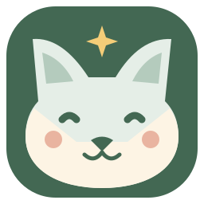
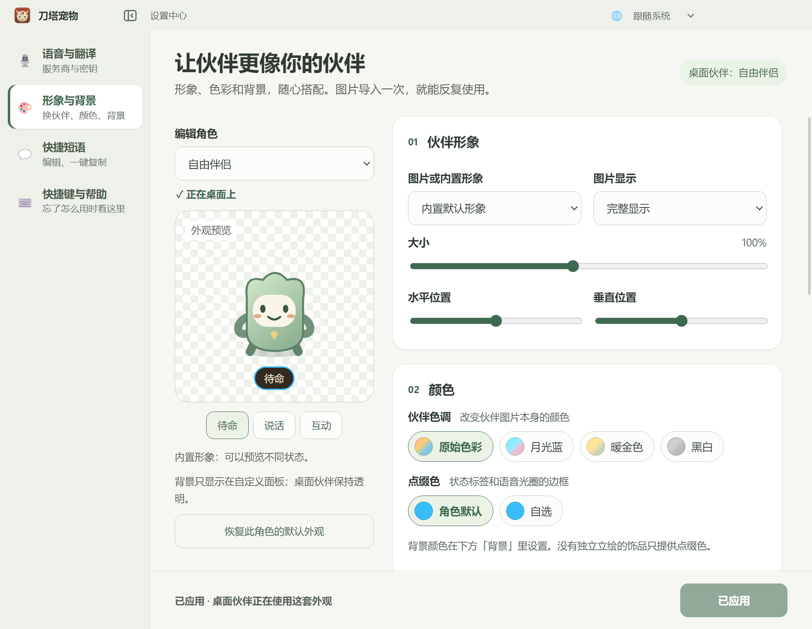
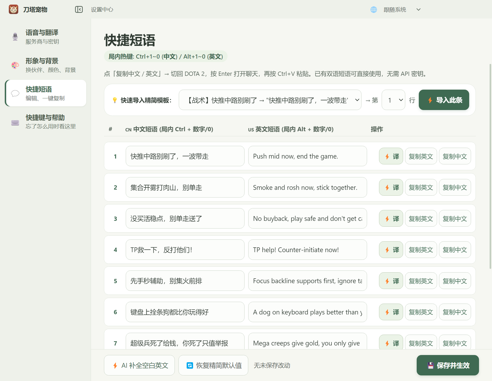
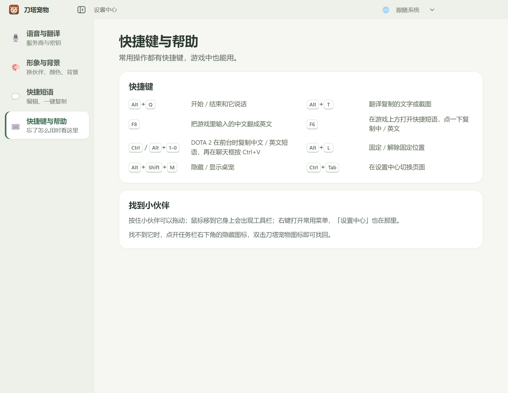
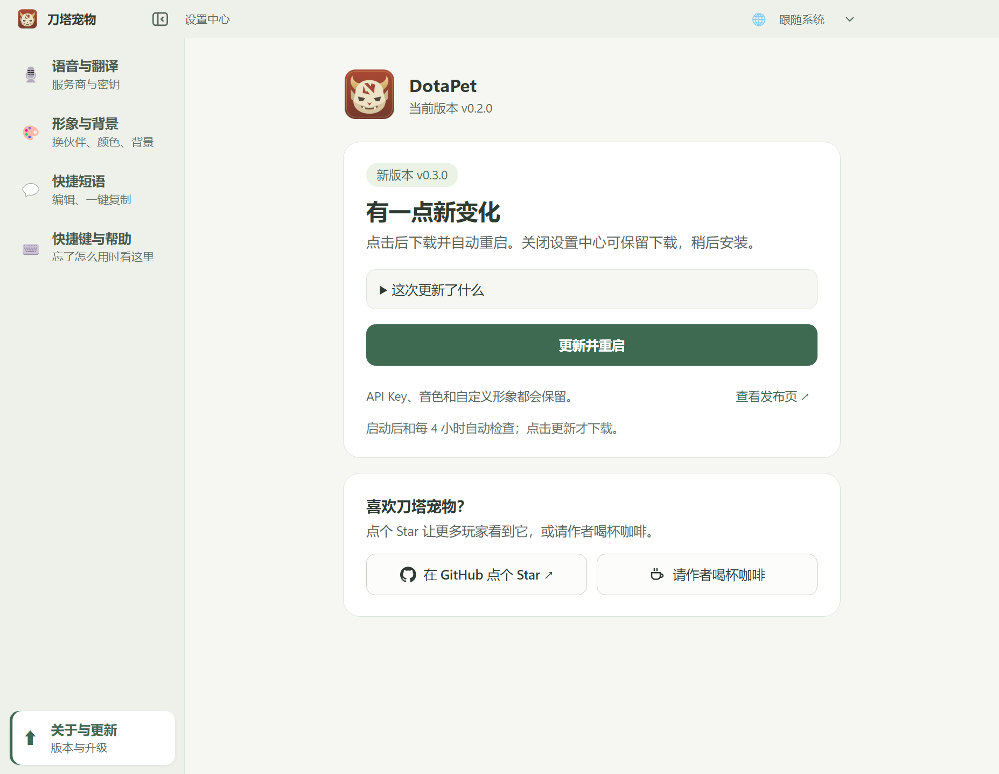
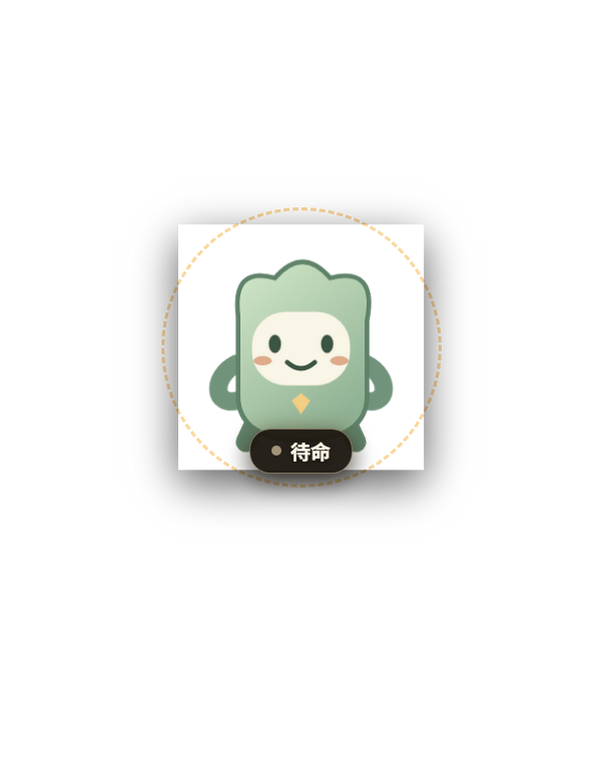
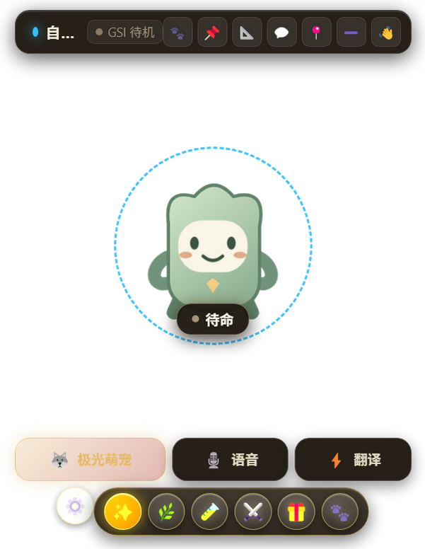
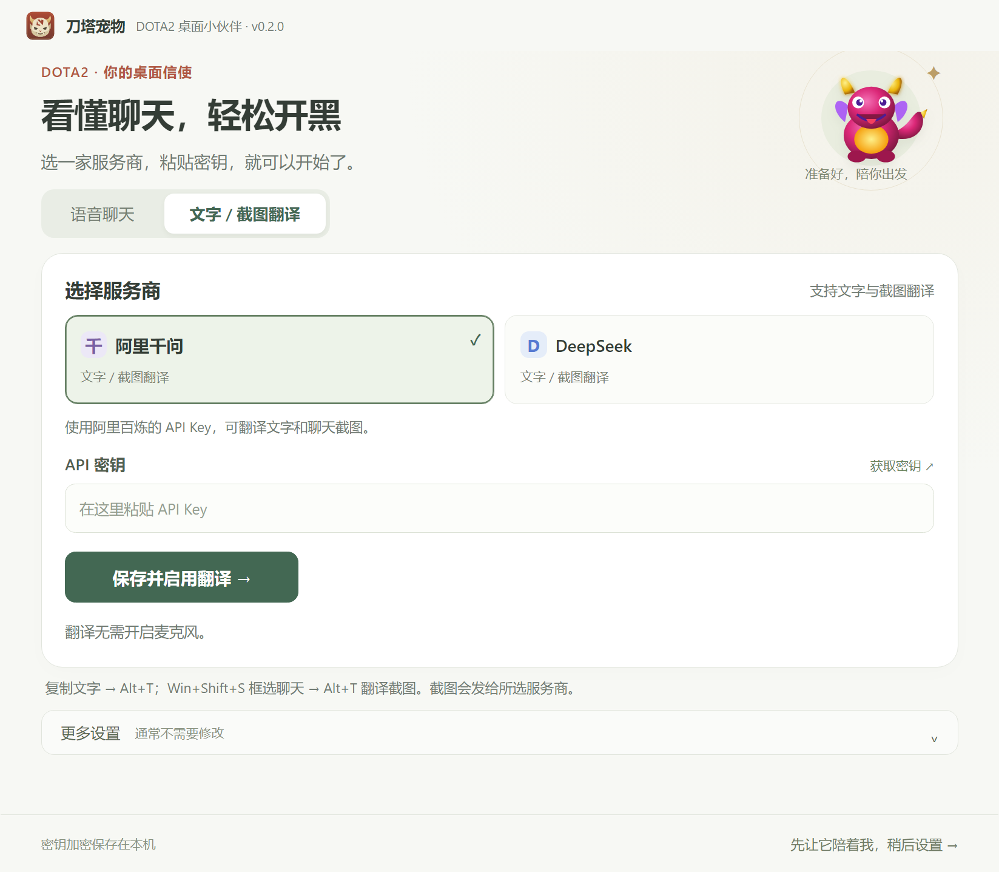
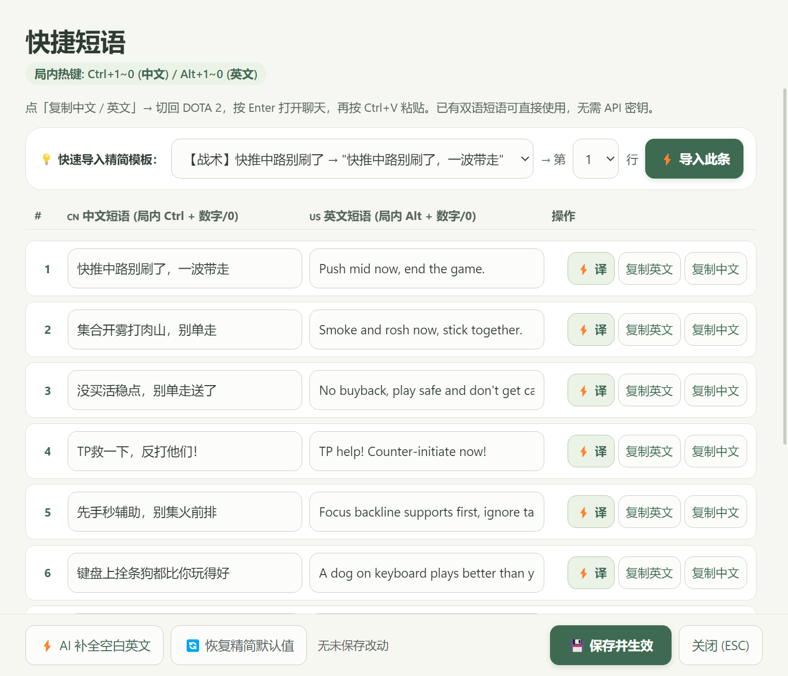

<div align="center">



# 刀塔宠物 · DotaPet

### 桌面上多一个伙伴，开黑时多一点默契。

DOTA 2 桌面陪伴 · AI 语音聊天 · 双语快捷短语 · 文字与截图翻译

[](https://github.com/xiaobaoliu849/dotapet/actions/workflows/ci.yml)
[](LICENSE)

[下载安装](https://github.com/xiaobaoliu849/dotapet/releases) · [使用指南](docs/README_COMPANION_RELEASE.md) · [更新记录](CHANGELOG.md) · [反馈建议](https://github.com/xiaobaoliu849/dotapet/issues)

**简体中文** · [English](README.en.md)

</div>

<br>

让英雄或信使住在桌面上，陪你聊天、漫游和互动。打起 DOTA 2 时，用快捷短语与队友沟通，或把聊天截图翻成中文。不配置 AI，也能先享受桌面陪伴。

**当前源码与构建为 0.2.0；GitHub 已发布安装包为 0.1.2。** 下方展示的是当前源码界面，新功能以 0.2.0 为准。本项目仍是 Windows 早期体验版。


<p align="center"><sub>一个设置中心，集中管理服务商、形象、短语和帮助。中文 / English / Русский / Українська，可在标题栏切换。</sub></p>

## 一个伙伴，几种陪伴方式

| | 现在可以做什么 |
|---|---|
| **桌面陪伴** | 英雄与信使形象、桌面漫游、拖动和互动。鼠标移上去才显示工具栏，右键打开常用菜单。 |
| **语音聊天** | 千问、豆包、Gemini、Cartesia 四个入口，常用音色和本机麦克风检查。相同服务的密钥在语音与翻译间复用。 |
| **聊天翻译** | 千问 / DeepSeek 文字与截图翻译；`Alt+T` 翻译剪贴板，`F8` 翻译自己的游戏聊天输入。 |
| **快捷短语** | 在设置里直接编辑双语短语；`F6` 打开浮动面板。无需 API 密钥即可复制已有中英文短语。 |
| **随心换装** | 自定义形象、色调、背景、图片收藏与可复用预设。预览满意后，再应用到桌面伙伴。 |
| **对局联动** | DOTA 2 GSI 英雄识别、战斗事件与游戏计时提醒。 |

## 看看新的界面

<table>
  <tr>
    <td width="50%"><strong>形象与背景</strong><br><sub>固定的角色预览，独立滚动的外观设置。</sub></td>
    <td width="50%"><strong>双语快捷短语</strong><br><sub>直接编辑，随时复制，F6 面板同步使用。</sub></td>
  </tr>
  <tr>
    <td></td>
    <td></td>
  </tr>
  <tr>
    <td><strong>快捷键与帮助</strong><br><sub>忘了怎么用，回到这里就能找到。</sub></td>
    <td><strong>关于与更新</strong><br><sub>版本更新和项目支持，各有一张卡片。</sub></td>
  </tr>
  <tr>
    <td></td>
    <td></td>
  </tr>
</table>

<p align="center"><sub>更新截图里的 0.3.0 是演示数据，不代表已发布。全部截图由实际 Electron 界面生成，未使用个人密钥。</sub></p>

<details>
<summary><strong>再看看桌面伙伴、翻译和浮动短语面板</strong></summary>

<p align="center">
  
  
</p>





</details>

## 三步开始

1. **安装。** 从 [GitHub Releases](https://github.com/xiaobaoliu849/dotapet/releases) 下载已发布的 `DotaPet-Setup-0.1.2.exe`。普通用户不需要安装 Node.js；想体验上述最新界面，可从源码运行 0.2.0。
2. **选择陪伴方式。** 当前源码首次启动直接进入设置。想聊天，就选择服务商、粘贴自己的密钥并点击「保存并开始聊天」；想先看看伙伴，就点「稍后设置」。
3. **回到桌面。** 鼠标移到伙伴身上显示工具栏，右键打开「设置中心」。找不到伙伴时，双击任务栏托盘图标。

在语音设置中填写「希望小伙伴怎么称呼你？」（如小宝、队长或 Daddy）；「更多设置」里的聊天偏好可以补充语气、回答方式和朋友的称呼。偏好在语音服务商之间共用，保存并重新连接后生效。每次主动建立新的聊天连接，小伙伴都会先开口打招呼；重复开关麦克风或测试连接不会重复问候，实时语音翻译不受影响。

### 开黑时，用这些快捷键

| 你想做什么 | 快捷键 / 操作 |
|---|---|
| 与伙伴说话 | `Alt+Q` 开始 / 结束语音 |
| 翻译聊天截图 | `Win+Shift+S` 框选聊天，再按 `Alt+T` |
| 翻译复制的文字 | 复制文字，再按 `Alt+T` |
| 把自己输入的中文翻成英文 | 在 DOTA 2 聊天框输入中文，再按 `F8`，检查后自己发送 |
| 打开浮动短语面板 | `F6` |
| 复制第 1–10 条中 / 英文短语 | DOTA 2 在前台时，`Ctrl+1–9/0` / `Alt+1–9/0`；再按 `Ctrl+V` 粘贴 |
| 隐藏 / 显示伙伴 | `Alt+Shift+M` |
| 切换设置页面 | `Ctrl+Tab` |

翻译无需开启麦克风。已有双语短语可以直接使用；语音聊天和云翻译需要自己的服务商账户及密钥。

## 使用与更新

密钥由 Windows 本机加密保存。使用语音或截图翻译时，相应内容会发送给所选服务商，并按其规则计费。截图只框选聊天区域即可；请勿把密钥或个人配置提交到仓库。

0.2.0 起提供应用内更新：**设置中心 → 关于与更新 → 更新并重启**。启动后及每 4 小时自动检查正式发布版本，仅检查不会下载。更新保留密钥、音色和自定义形象；关闭设置中心可稍后安装。旧版需要先手动安装一次 0.2.0，前提是该版本已发布。

安装包目前未签名。真实云端识别、响应速度和游戏全屏兼容仍需实际对局验证；当前没有持续自动 OCR，也没有队友语音识别。设置与 F6 面板支持四种语言，伙伴工具栏、菜单与托盘仍为中文。俄文与乌克兰文仍需母语使用者校对。

[安装与设置](docs/README_COMPANION_RELEASE.md) · [自定义形象](docs/README_CUSTOMIZATION.md) · [界面语言](docs/README_I18N.md) · [聊天识别路线](docs/COMPANION_CHINA_TRANSLATION_PLAN.md)

## 本地开发

Windows，Node.js 22：

```powershell
git clone https://github.com/xiaobaoliu849/dotapet.git
cd dotapet
npm ci
npm start
```

| 任务 | 命令 |
|---|---|
| 回归测试 | `npm test` |
| 桌面冒烟检查 | `npm run smoke` |
| 语言与布局检查 | `npm run smoke -- --lang=en`（也支持 `zh`、`ru`、`uk`） |
| 更新文档截图 | `npm run docs:screenshots` |
| 构建 Windows 安装包 | `npm run dist` |
| 检查打包程序 | `node scripts/smoke-desktop.mjs release/win-unpacked/DotaPet.exe` |
| 验证更新下载与校验 | `npm run test:update-download`（先构建安装包） |

截图与冒烟检查使用临时数据目录和模拟音频设备。截图重建方式见 [截图说明](docs/images/README.md)。安装与卸载验收在干净 Windows 账户或 Sandbox 中执行，见使用指南。

<details>
<summary>项目结构与发布方式</summary>

```text
src/main/       窗口、托盘、快捷键、GSI、设置与游戏输入
src/preload/    各窗口限定的 IPC 接口
src/renderer/   桌宠、设置中心及其各页面
src/services/   语音、翻译、角色与外观
src/i18n/       界面语言字典
tests/          自动回归测试
scripts/        图标、截图、打包与升级验收
docs/           使用说明与截图
```

推送匹配 `package.json` 版本的 `v0.x.y` 标签，会运行 Windows 测试、界面语言检查、打包程序检查和更新下载校验，再发布安装包、`latest.yml`、`.blockmap` 与 SHA256 校验值。手动运行 release 工作流只生成构建产物。

仓库从 0.1.0 开始编号，此前本机试制的 1.x 不表示正式稳定版。沿用原应用标识与 `%APPDATA%\dota2-voicespirit-companion` 数据目录。源码版本、构建产物与 GitHub 发布版本是分别更新的。

</details>

## 一起让伙伴变得更好

喜欢它的话，欢迎在 [GitHub 点一个 Star](https://github.com/xiaobaoliu849/dotapet)。报告问题时，请附应用版本、Windows 版本、游戏显示模式和复现步骤；截图记得隐去个人信息。

代码使用 [MIT License](LICENSE)。DOTA 2 与相关角色名称的权利属于各自权利人；本项目是非官方玩家项目，与 Valve 无隶属关系。第三方组件与素材说明见 [NOTICE](NOTICE.md)。
