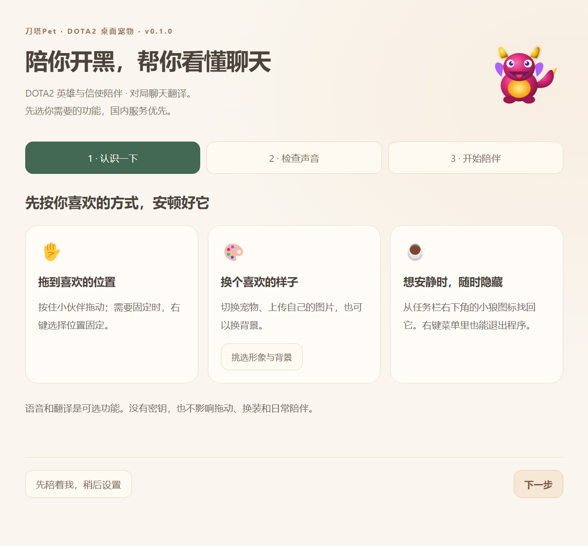

# 刀塔Pet · DotaPet

陪你开黑的 DOTA2 桌面宠物，支持英雄与信使陪伴、AI 语音对话和游戏聊天翻译。

**当前版本：0.1.0，Windows 早期体验版。** 功能仍在快速迭代，真实对局的截图识别准确率、响应速度和全屏兼容性需要持续验证。



翻译与语音按用途分别设置：[查看设置界面](docs/images/translation-settings.png)。

## 下载安装

从 [Releases](https://github.com/xiaobaoliu849/dotapet/releases) 下载 `DotaPet-Setup-0.1.0.exe` 并运行。普通用户不需要安装 Node.js。

程序启动后可拖动宠物，右键切换形象、调整设置；任务栏托盘图标可以找回隐藏的桌宠。不配置 AI 也可使用桌面互动。

## 已有功能

- 英雄与信使形象、桌面漫游、互动和自定义图片／背景／预设。
- DOTA2 GSI 联动：英雄识别、战斗事件和游戏计时提醒。
- 国内服务优先的语音设置：千问、豆包；本机麦克风检查。
- 千问／DeepSeek 文字与聊天截图翻译，Windows 加密保存个人密钥。
- 游戏快捷短语和自己聊天输入框的中文转英文。

## 快速操作

| 目的 | 操作 |
|---|---|
| 看懂队友聊天 | 设置选择「翻译文字 / 截图」→ 千问或 DeepSeek → 填密钥并测试 → `Win+Shift+S` 框选聊天 → `Alt+T` |
| 翻译已复制的文字 | 复制文字 → `Alt+T` |
| 自己发英文 | 游戏聊天框输入中文 → `F8` 翻成英文 → 检查后自己按 Enter |
| 与桌宠语音对话 | 设置选择「语音对话」→ 千问或豆包 → 填密钥、测试、连接 → `Alt+Q` 开关麦克风 |
| 快捷短语 | `F6` |

翻译无需开启麦克风。截图会发送到你选择的服务商，云端用量按其规则计费。F8 读取自己的输入框；当前没有持续自动 OCR 或队友语音识别。

完整说明：[安装与设置](docs/README_COMPANION_RELEASE.md) · [自定义形象](docs/README_CUSTOMIZATION.md) · [聊天识别路线](docs/COMPANION_CHINA_TRANSLATION_PLAN.md)。

## 本地开发

Windows，Node.js 22 或更新的受支持版本：

```powershell
git clone https://github.com/xiaobaoliu849/dotapet.git
cd dotapet
npm ci
npm start
```

```powershell
npm test
npm run smoke
npm run dist
node scripts/smoke-desktop.mjs release/win-unpacked/DotaPet.exe
```

源码和打包程序的冒烟测试使用临时用户目录和模拟音频设备，不访问真实麦克风或连接个人云端账户。安装与卸载验收只应在干净账户／Windows Sandbox 中执行，见使用说明。

## 项目结构

```text
src/main/       窗口、托盘、快捷键、GSI、设置与游戏输入
src/preload/    各窗口限定的 IPC 接口
src/renderer/   桌宠、设置、引导与形象编辑界面
src/services/   语音服务、翻译、角色与外观逻辑
tests/          自动回归测试
scripts/        图标、打包启动与安装升级验收
docs/           使用说明、版本记录与计划
```

## 版本与更新

开源仓库从 `0.1.0` 开始：问题修复用 `0.1.1`，功能迭代用 `0.2.0`，稳定性和主要体验达标后再考虑 `1.0.0`，不按更新次数升级主版本号。查看 [变更记录](CHANGELOG.md)。

此前本机试制的 `1.x` 编号不代表正式稳定版，也没有在这个仓库发布。迁移为 DotaPet 后沿用原应用标识及 `%APPDATA%\dota2-voicespirit-companion` 数据目录；更新前退出旧程序，再手动运行新安装包。当前没有应用内自动更新。

推送 `v0.x.y` 标签会运行 Windows 检查、打包并发布体验版到 Releases，安装包不提交到源码仓库。

## 贡献与许可

欢迎通过 [Issues](https://github.com/xiaobaoliu849/dotapet/issues) 报告问题和建议。请附版本、Windows 版本、游戏显示模式、复现步骤，以及已隐去个人信息的截图；不要提交 API Key 或个人配置文件。

项目代码使用 [MIT License](LICENSE)。DOTA2 及相关角色名称的权利属于其相应权利人，本项目是非官方玩家项目，与 Valve 无隶属关系。第三方组件及素材说明见 [NOTICE](NOTICE.md)。
