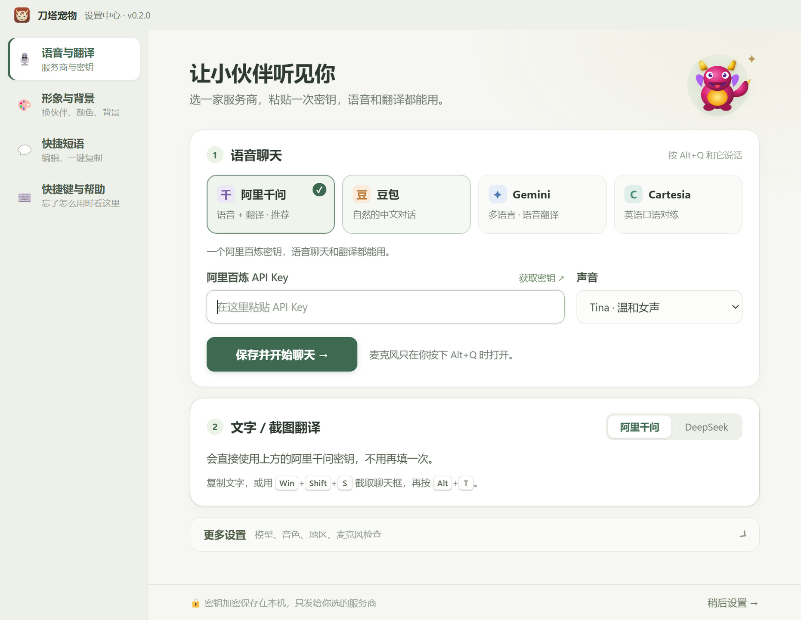
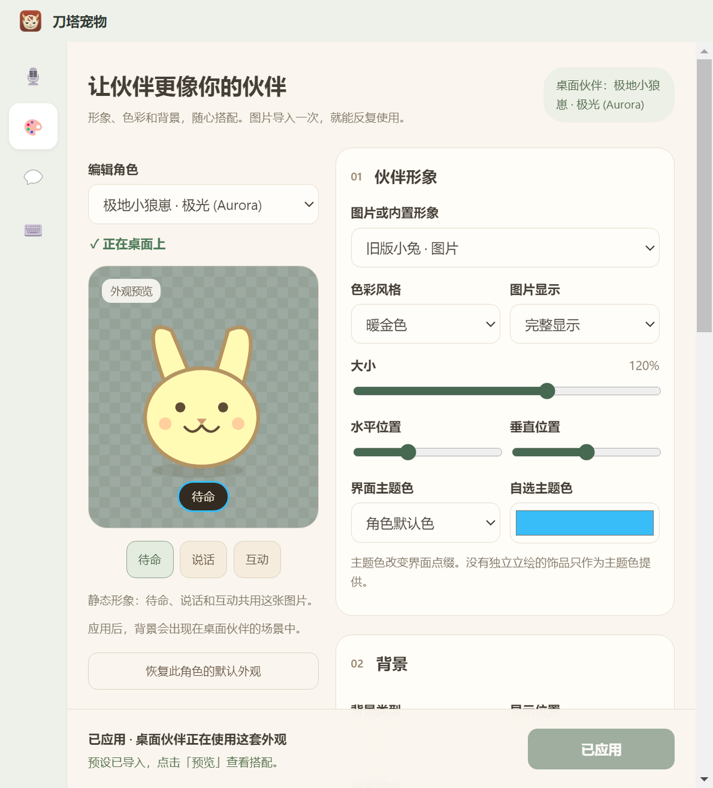
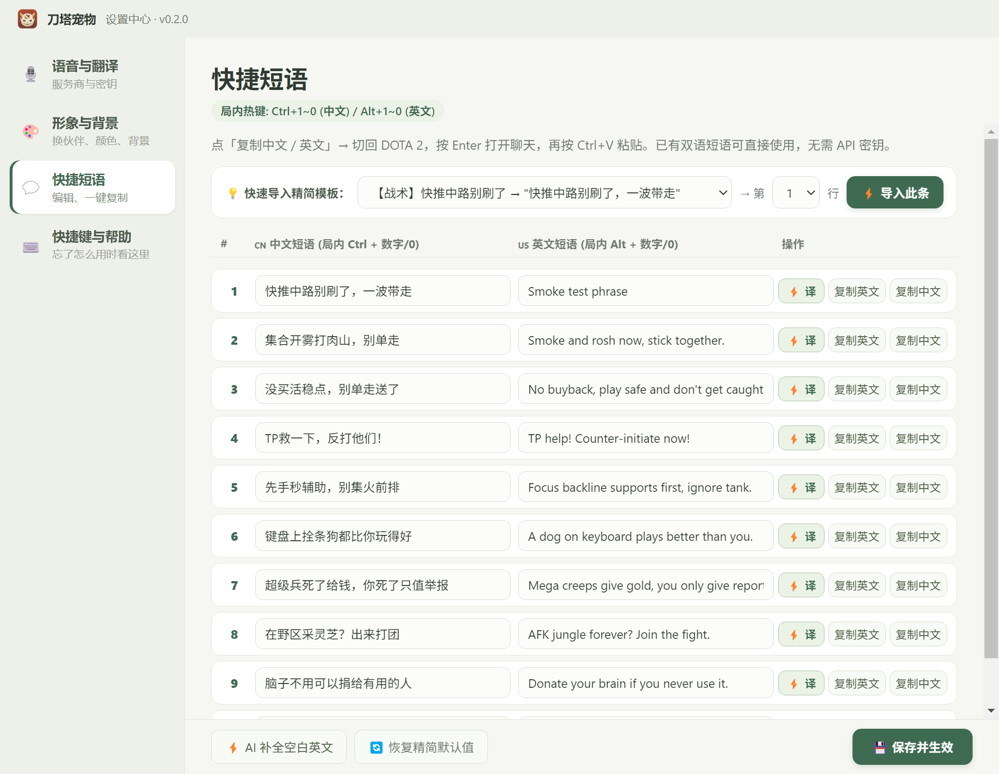
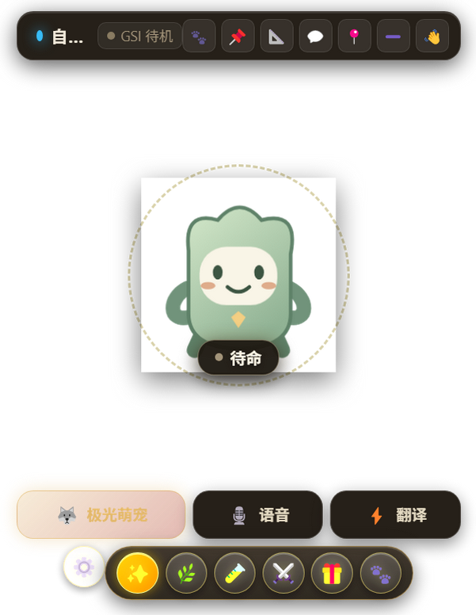
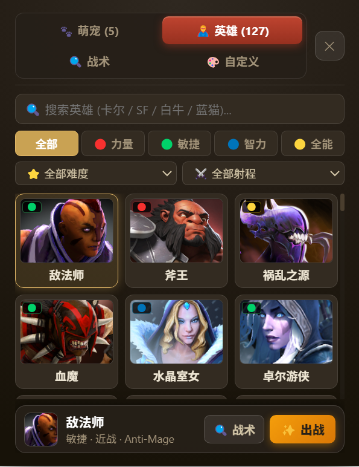
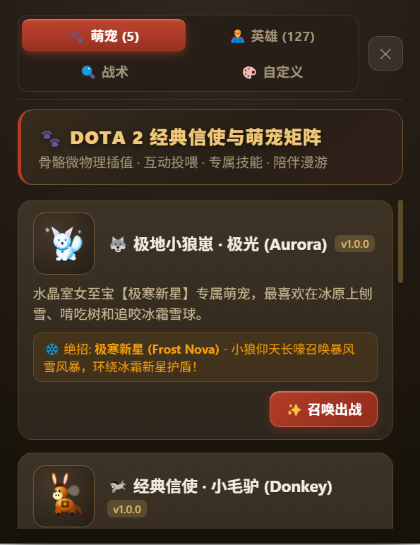
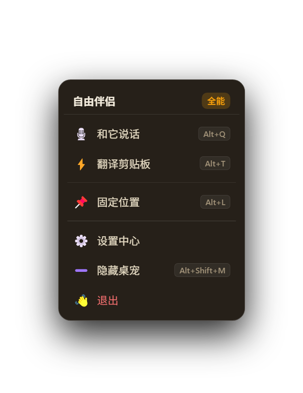

# DotaPet application review — 8 October 2026

Initial review: local version **0.2.0**, commit **cb5b95a**, on Windows. The working tree was clean before the review. Application code and personal settings were left unchanged during that review. Subsequent approved fixes are recorded below.

**Adversarial review before GitHub push — 8 October 2026**

Four additional failures were reproduced against the first implementation before applying fixes:

| Reproduced failure | Resolution |
| --- | --- |
| Two phrase editors submit old full-list snapshots; one save erases the other's different-row edits. | Merge only changed rows into the current saved list. Check their original values for conflicts, return canonical saved data, and use revisions to ignore older replies. Same-row conflicts preserve the draft and offer an explicit overwrite action; another intervening edit is checked again. |
| A stalled foreground query retains all twenty digit hotkeys while awaiting its RPC timeout. | An independent 500 ms lease releases the keys when foreground evidence expires, provided the app event loop is responsive. Late query results and callbacks from an expired focus scope cannot reactivate them or write the clipboard. |
| A retired input helper emits exit/EPIPE events after its replacement starts, rejecting the replacement's requests. | Bind events to the child process that produced them; ignore retired processes' events and stdout. |
| A helper request times out without retiring the hung process, so future requests reuse it. | Terminate the timed-out child, reject its queued requests, and allow the next request to start a replacement. |

Additional regression coverage checks malformed row patches, repeated same-row conflicts, edits during an acknowledged save, initialization before editing actions become available, and UTF-8 responses split across stream chunks.

Final verification: **160 tests passed** with no failures or skips. The isolated Electron smoke passed, including concurrent phrase saves, conflict preservation and confirmed overwrite, six gallery queries, and narrow layouts. The longer conflict action is checked at the panel's minimum width. The actual Windows foreground helper also passed a read-only restart check. Live Dota matches, elevated/fullscreen input, and cloud provider calls remain outside this verification. No remaining blocking defect was found in the reviewed changes.

[Narrow-window conflict state](images/review-2026-10-08/phrases-conflict.png) shows the preserved draft status and the explicit overwrite action; the text is an isolated smoke fixture.

**Approved follow-up — first three priorities fixed locally**

After the review, the user approved fixing the behavior issues below. Ctrl/Alt+digits now register only while Dota owns the foreground and release after switching away. Foreground polling normally runs every 125 ms; focus changes have a short detection delay. The callback checks foreground again before writing the clipboard. Failed helper queries release the keys and retry after two seconds. Existing desktop shortcuts remain available.

Hero search now resolves the advertised 卡尔 / SF / 白牛 / 蓝猫 examples, plus common acronyms and selected pinyin aliases. Empty results hide the selection dock, and clearing the search restores it. General pinyin support is no longer promised. Phrase translations preserve edits made while a request is pending; saving acknowledges only the submitted rows' revisions, with visible unsaved status. Phrase files replace the old file only after a complete temporary write; failed writes or replacements preserve the old file and cache.

Validation after these changes: **150 tests passed**, including **26 new regression tests**; the isolated Electron smoke passed, including six real gallery queries, empty/clear states, bilingual copying, editor synchronization and narrow layouts. A read-only check of the actual Windows foreground helper measured 40 warm queries at a median of roughly 2 ms (3 ms maximum); this is a local sample, not a general performance guarantee. Live Dota hotkey behavior still needs validation in a match. UI-wide styling and Electron upgrades remain follow-up work.

Updated captures: [working SF search](images/review-2026-10-08/hero-search-fixed.png), [phrase save status at narrow width](images/review-2026-10-08/phrases-status-fixed.png). The rest of this report records the original review snapshot.

**Assessment**

DotaPet has a credible early-release foundation. The settings center is understandable, the companion has personality, and important flows have real regression coverage. The greatest next improvement is making the whole experience feel coherent and predictable. Fix everyday behavior first, then bring the appearance editor and pet controls up to the standard of the service settings page.

Keep the existing sidebar, calm green settings palette, live appearance preview, explicit application button, local encrypted credential storage, and quiet resting pet. Those are useful product decisions.

**What was checked**

| Check | Result and scope |
| --- | --- |
| `npm test` | 124 tests passed; no failures or skips. Some test files also contain their own internally counted assertions. |
| `npm run smoke` | Passed in an isolated Electron user directory. Exercises first setup, encrypted persistence, simulated microphone input, navigation, appearance migration/import/application, phrase copying/synchronization, and simulated updates. |
| Actual Electron rendering | Inspected services, narrow services, connection states, advanced actions, help, appearance, narrow appearance, phrases, narrow phrases, updates, pet rest/hover, context menu, hero gallery, empty search, and pet gallery. |
| Additional gallery checks | Temporary Electron review harness using a copy of the main entry point with original modules, preloads and renderers; isolated data, no live cloud connections. Verified advertised search examples against the actual UI. |
| Failure and timing probes | Executed existing source functions in isolated Node VM contexts with a failing disk writer or delayed mocked IPC responses. Reproduced the phrase failures below. These are function-level reproductions, not real disk-full or slow-provider sessions. |
| Dependency checks | Full `npm audit`: 11 affected packages, including 3 high and 8 moderate. `npm audit --omit=dev`: zero findings. Installed Electron is 33.4.11. |

The update screenshots use simulated release data; they do not establish that version 0.3.0 is published. Appearance and phrase screenshots contain smoke fixtures, not personal user data. Transparent areas in pet captures can appear black in image viewers.

Live provider accounts, real microphone quality, DOTA matches, exclusive fullscreen, elevated game input, installer execution, update downloads, and resource usage were not validated. A passing smoke test does not certify those environments.

**Fix these behaviors first**

1. **High priority — game phrase shortcuts also capture normal desktop shortcuts.**

   The app registers 35 global shortcuts, including all 20 Ctrl/Alt + digit combinations. Ctrl+1 invokes the phrase callback without a foreground-game condition, and the callback writes a phrase to the system clipboard. This can interfere with browser tab switching and other applications, even when DOTA is not active. The UI calls these “in-game hotkeys,” which makes the behavior especially surprising.

   Register the digit shortcuts only while an explicitly enabled game mode is active, and expose their state and bindings under shortcuts. A foreground check inside an already registered callback prevents a clipboard write but still leaves the operating system consuming the shortcut; address registration as well as callback behavior. Retain desktop voice/translation shortcuts as explicit user choices.

   Evidence: [shortcut registration](https://github.com/xiaobaoliu849/dotapet/blob/cb5b95a/src/main/shortcuts.js#L51), [clipboard callback](https://github.com/xiaobaoliu849/dotapet/blob/cb5b95a/src/main/index.js#L670). The isolated probe registered 35 callbacks, found 20 digit bindings, and invoked the phrase callback without a game check. It did not register real Windows hotkeys.

2. **Medium priority — the search examples do not work.**

   The gallery suggests 卡尔 / SF / 白牛 / 蓝猫 and the empty state promises pinyin and aliases. Actual renderer results:

   | Query | Matches |
   | --- | ---: |
   | 卡尔 | 0 |
   | SF | 0 |
   | 白牛 | 0 |
   | 蓝猫 | 0 |
   | kaer | 0 |
   | Invoker | 1 |
   | 祈求者 | 1 |

   The matcher supports an optional `aliases` array, but the supplied hero configuration does not populate it, and there is no pinyin conversion. Add curated common aliases and pinyin/search keys, then test the examples displayed in the UI. Until supported, remove the pinyin promise. Also disable or clear the selection dock when no search results exist; currently it continues offering the previously selected hero for equipment.

   Evidence: [placeholder](https://github.com/xiaobaoliu849/dotapet/blob/cb5b95a/src/renderer/index.html#L201), [search matcher](https://github.com/xiaobaoliu849/dotapet/blob/cb5b95a/src/renderer/app.js#L2012), [empty-state early return](https://github.com/xiaobaoliu849/dotapet/blob/cb5b95a/src/renderer/app.js#L2024). Search counts above came from the actual Electron renderer.

3. **Medium priority — a failed phrase save still changes the active phrases.**

   `savePhrasesConfig` assigns `cachedPhrases` before writing the file. With a simulated write failure it returns `success: false`, but the next read returns the new phrases. The hotkeys can therefore use changes reported as unsaved; restarting restores the old file. The other editor also misses the synchronization broadcast because it is sent only after a successful write.

   Validate the payload, write successfully before committing the cache, and use an atomic file replacement. Verify that a failed write leaves both the active list and stored file unchanged.

   Evidence: [phrase persistence](https://github.com/xiaobaoliu849/dotapet/blob/cb5b95a/src/main/index.js#L658). Probe: old list → attempted new list → failed save → active list is nevertheless new.

4. **Medium priority — a delayed AI translation overwrites newer edits.**

   Start translating a row, change its Chinese source or manually correct the English while the request is pending, then let the response finish. The old response replaces the current English and announces success. The same unconditional assignment exists in batch completion.

   Track a revision per row and the submitted source. Apply a response only when the row still exists and its source and destination remain compatible with that request. Otherwise preserve the user's edit and offer the returned translation separately. Invalidate pending results after reset or template replacement.

   Evidence: [single-row response](https://github.com/xiaobaoliu849/dotapet/blob/cb5b95a/src/renderer/phrases.js#L101), [batch response](https://github.com/xiaobaoliu849/dotapet/blob/cb5b95a/src/renderer/phrases.js#L180). Probe: changed source + new manual translation → response for old source → manual translation overwritten.

5. **Medium priority — edits made during a save lose their protection.**

   Only the Save button is disabled during phrase saving. If a user types while the save response is pending, success clears every dirty row, including text newer than the submitted snapshot. A subsequent save broadcast from the other editor can overwrite that text. This is a narrower timing window than the translation race, but the current synchronization protection depends on this dirty state.

   Clear only revisions represented by the successful save, and show that newer edits remain unsaved. Preserve those revisions when synchronizing the second editor.

   Evidence: [save completion](https://github.com/xiaobaoliu849/dotapet/blob/cb5b95a/src/renderer/phrases.js#L222), [cross-editor synchronization](https://github.com/xiaobaoliu849/dotapet/blob/cb5b95a/src/renderer/phrases.js#L253). The delayed-IPC probe reproduced both the cleared dirty state and the subsequent overwrite.

**UI changes with the highest payoff**

| Area | Observed issue | Concrete improvement |
| --- | --- | --- |
| Shared settings style | Services/help/phrases use a green canvas; appearance switches to beige and brown, smaller typography, and different controls. Updates use another type scale. | Share typography, surfaces, border colors, button sizes and focus styles across all settings pages. Keep character color choices inside the preview. |
| Pet toolbar | Hover reveals seven top icons, three main actions and seven lower tools. The companion name is reduced to “自…” in the captured default layout. Strong glow effects compete with the pet. | Keep Voice, Translate and a menu as the primary actions. Group play/feed tools into a second-level panel. Move window utilities into the menu and give the companion name room. Reduce permanent glows; reserve stronger effects for interaction feedback. |
| Appearance editor | A long character dropdown and four stacked sections make basic changes feel like an editor. In narrow layouts the two-column preview/settings arrangement remains dense. | Add searchable character cards or favorites. Show Character, Size and Background first; collapse positioning and preset tools. Use a single-column layout when the remaining content width is small. Keep the existing preview and Apply behavior. |
| Voice startup | Startup intentionally does not connect. Pressing Voice with a saved configuration still opens setup because `startMicrophone` checks only `voiceConnected`. | On an explicit Voice click, connect the saved provider on demand and display Connecting → Listening. Open setup when credentials are missing or need correction. Keep cloud connection and microphone activation tied to explicit user action. |
| Voice action copy | “保存并开始聊天” connects the provider, while the nearby text says the microphone opens later with Alt+Q. | Use “保存并连接语音” or make the action actually progress into the explicitly requested conversation. Show service-connected and microphone-active as separate states. |
| Phrase editor | Long messages clip in single-line inputs. There is no persistent unsaved indicator. Several defaults are insults while the app otherwise presents a friendly companion. | Use expanding text fields or a row detail editor, a persistent unsaved marker, and tactical/friendly defaults. Put taunts in an optional template category. |
| Copy feedback | The hotkey handler copies text, but some HUD wording says it was “sent.” | Consistently say “已复制，回到游戏粘贴”; reserve “sent” for an actual send action. |
| Pet selection copy | “骨骼微物理插值,” “矩阵,” and manifest `v1.0.0` badges appear in the gallery. | Use “选择你的小伙伴” and describe visible abilities. Put engine/package version information in About or diagnostics. |
| Transcript behavior | Closing the transcript is undone by subsequent text, interim and final events. This behavior is disclosed in the tooltip, but offers little control during a game. | Remember the hide choice for the current conversation; expose an automatic-transcript preference. |
| Small-window navigation | The compact sidebar becomes emoji-only. | Use a consistent icon family, clear tooltips and accessible names. Add a page title where the current screen lacks one. |

The light service settings page should be the reference for settings polish. The pet can retain a darker DOTA-inspired appearance while sharing the same icon style, naming and action hierarchy.

**Readability and motion**

Contrast calculated from the declared CSS colors:

| Color pair | Ratio | Use |
| --- | ---: | --- |
| `#98a196` on `#f6f7f2` | 2.48:1 | Faint captions/footer text |
| `#6f7a70` on `#f6f7f2` | 4.16:1 | Muted service-page text |
| `#847968` on `#faf6ef` | 3.97:1 | Muted appearance-page text |

Darken meaningful secondary text and bring small labels into a consistent readable scale. These examples fall below the 4.5:1 benchmark for normal text in [W3C's contrast guidance](https://www.w3.org/WAI/WCAG22/Understanding/contrast-minimum.html). This is a targeted color check, not a complete accessibility audit; gradients, individual surfaces and control states also need checking.

Settings CSS respects reduced-motion preferences, but the main pet stylesheet has repeating animations without a corresponding reduced-motion rule. Extend the preference to the pet's decorative effects. The hero and GSI badges are clickable divs; make them keyboard-operable controls with accessible names. These changes improve ordinary keyboard use as well as accessibility.

**Release and maintainability**

Electron **33.4.11** is installed. Electron 33 reached end of life on **28 April 2025**, according to the [official release schedule](https://releases.electronjs.org/schedule). Upgrade to a supported stable line before a wider public release and revalidate transparent windows, WebContentsView composition, audio, global shortcuts, updater behavior and packaging. [Electron's security guidance](https://www.electronjs.org/docs/latest/tutorial/security) recommends keeping the framework current.

The full audit reports affected development/build packages. The production-only audit is clean, but Electron is declared as a development dependency while its runtime is shipped with the desktop application. A production-only audit therefore does not certify the embedded Chromium/Electron runtime. Audit findings are not proof that every advisory is reachable in this app; macOS-only or unused-feature issues need separate triage. Avoid an automatic force-fix: the audit's builder suggestion includes a downgrade and the Electron suggestion is a major upgrade.

125 of 127 configured hero portraits use remote Steam URLs. The gallery initially showed blank thumbnails and populated after waiting for the images; this is an observed loading state, not a measured latency benchmark. Provide immediate local placeholders and consider a local thumbnail cache for repeat use. Error fallbacks already exist, so improve pending-load presentation as well as failure handling.

The main process and pet renderer contain many unrelated responsibilities in large files. After the behavior fixes, extract phrase persistence/IPC, gallery search, shortcut management and transcript behavior into focused modules. The existing tests give a useful safety net; add regression cases for the specific failures above instead of increasing test counts for their own sake.

**Suggested order of work**

1. Correct shortcut scope and gallery search; fix phrase commit order and both asynchronous edit races.
2. Unify settings styling, improve text contrast, and simplify the pet toolbar.
3. Make daily voice activation easier, add persistent draft feedback, and tighten copy/template defaults.
4. Upgrade Electron and run a packaged-app smoke check, then validate one real-provider conversation and one real DOTA translation session in each supported display mode.

The first two steps would deliver the most noticeable improvement without adding another large feature.

**Screenshots from this review**

Service settings — the clearest current visual reference:

Narrow appearance editor — different palette and a dense two-column layout; the rabbit is a smoke fixture:

Phrase editor — functional in-place editing and fixed bottom actions; values include smoke fixtures:

Pet hover toolbar — many simultaneous controls and a truncated companion name:

Hero gallery after images loaded — actual compact 340 × 440 logical-pixel companion window:

Pet gallery — technical engine copy and package versions are visible:

Context menu — already a simpler hierarchy worth building on:

